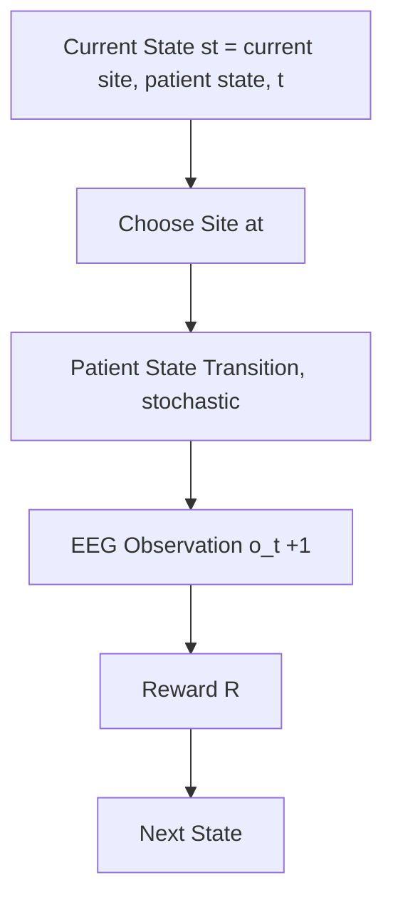

# Adaptive Multi-Site Stimulation Control Using RL in an MDP

## Learning sequential stimulation policies under state-dependent EEG response dynamics

**Team Members**: Fatih Karatay & Cody Moxam
**Class**: EN.705.741.8VL Reinforcement Learning

## Game (1)

- Summary of the Test-Then-Treat (T3) Game
  - Agent:
    - Single RL agent (decision-maker)
- Environment:
  - Stochastic
  - Episodic
  - Finite-horizon MDP
- Tokens:
  - Stimulation Sites (S1, S2, S3, S4): Four discrete brain regions the agent can target
  - Start State: Initial state before any stimulation is applied.
  - Patient State Indicator: A latent internal state {baseline, receptive, non-receptive} reflecting cumulative physiological response to stimulation history — dynamic, transitions stochastically based on agent actions
    - Repeated stimulation of the same site can transition the patient from baseline -> receptive -> nonreceptive, affecting future reward quality
  - EEG Response Signal: Categorical observation returned after each stimulation o ∈ {favorable, neutral, unfavorable} — dynamic, sampled from P(o | site, patient_state)
  - Episode Counter (t): Tracks time step within the finite horizon — dynamic, controlled by environment

## Game (2)

- Goal
  - Maximize expected episodic return by learning which stimulation sites to choose and when to switch over a finite horizon, accounting for how the patient’s state evolves.
- MDP components
  - State: $s_t = (current site, patient state, t)$ where patient state $∈ (baseline, receptive, non-receptive)$
  - Actions: $a_t= (S1, S2, S3, S4)$
  - Observations: $O_{t+1} ~ P(o | a_t, patientstate_t)$
  - Observation model: $P(o_{t+1} | a_t, patientstate_t)$ depends on BOTH site and patient state
  - Patient State Transition: $T(patientstate_{t+1} | patient_state_t, a_t)$ [stochastic]
  - Reward: $rt = g(o_{t+1}) - cswitch 1$ at not equal to current site
- Why MDP:
  - The next outcome depends only on the current state and chosen action; there is no hidden latent state.
- Why this is RL (not a bandit):
  - Stimulating the same site repeatedly drives the patient toward receptive then non-receptive
  - Switching sites allows recovery toward "baseline” and exploitation of other rewarding sites
  - Actions taken now change the distribution of future states which delayed consequences require sequential credit assignment

  ## Game (3)

Sequence of Play (Episode Flow):

- Initialize
  - Start at initial state s0 = (Start, baseline , 0)
- At each step
  - Observe state $s_t = (current site, patient state, t)$
  - Choose action at using ε-greedy policy
  - Patient state transitions stochastically: $patientstate_{t+1} ~ T(· | patient_state_t, a_t)$
  - Observe EEG outcome ot+1 ~ P(o | at, patient-state_t)
  - Receive reward rt = g(ot+1) - cswitch · 1[at ≠ current site]
  - Transition to next state st+1 = (at, patient-state\_{t+1}, t+1)
  - Update action-value estimate Q(current-site, patient-state, t, action)
- Learning Representation
  - The agent learns a tabular action-value function: Q(st, at)
    - Where s_t = (current site, patient state, t)
- Behavior Policy
  - With probability 1- ε: choose greedy action
  - With probability ε: choose random action

## Game: (4)

- Action space:
  - $𝒜 = (S_1, S_2, S_3, S_4)$
  - If action $a_t = S_j$
    - Patient state transitions: $patientstate_{t+1} ~ T(· | patientstate_t, S_j)$
    - Observe EEG response: $O_{t+1} ~ P(o | S_j, patientstate_t)$
    - Receive reward: $rt = g(o_{t+1}) – cswitch · 1$ (at not equal to current site)
- Reward mapping
  - Favorable: $+1$
  - Neutral: $0$
  - Unfavorable: $-1$
- Win & Loss Conditions
  - Win: Cumulative episodic return $G > 0$ (net-positive EEG outcomes across the session)
  - Neutral: $G = 0$ (favorable and unfavorable outcomes cancel)
  - Loss: $G < 0$ (net-negative outcomes; poor site choices or patient driven into non-receptive state)
- Episode termination
  - Episode ends at horizon I
- Key dynamics:
  - Repeated stimulation of the same site increases probability of transitioning to non-receptive state
  - Switching sites increases probability of recovery toward baseline
  - Reward depends on both selected site and patient state

## Game Complexity: (1)

- States
  - State: $s_t = (current site, patientstate, t)$
  - Current site $∈ (Start, S_1, S_2, S_3, S_4) → 5$ values
  - Patient state $∈ (baseline, receptive, nonreceptive) → 3$ values
  - Time step $t ∈ (0, 1, ..., I) → I+1$ values $|S| = 5 × 3 × (I + 1)$
- Actions
  - $|A| = 4$
- Terminal condition
  - Episode ends after I stimulation decisions (all states at $t = I$ are terminal)
- State-action size
  - $|S| x |A| = 5 × 3 × (I+1) × 4$
- Example
  - If $I = 10$, then:
    - $|S| = 5 × 3 × 11 × 4 = 660$
    - State space is fully tabular. All planned RL algorithms apply unchanged

## Game Complexity: (2)

- Patient State Transition Model - $T(patientstate' | patientstate, action)$: - Current State | Action | → baseline | → receptive | → non-receptive - baseline | any site | 0.60 | 0.30 | 0.10 - receptive | same site | 0.20 | 0.30 | 0.50 - receptive | different site | 0.50 | 0.30 | 0.20 - non- receptive | same site | 0.10 | 0.10 | 0.80 - non- receptive | different site | 0.40 | 0.30 | 0.30
  Note: Exact probabilities are initial estimates subject to tuning during development.
- Repeated stimulation of the same site increases probability of transitioning toward non-receptive state.
- Switching sites promotes recovery toward baseline.

## Game Complexity: (3)

- Observation Model
  - EEG response depends on BOTH site and patient state: P(o | site, patient_state)
  - Site | Patient State | Favorable | Neutral | Unfavorable
    - S1 | baseline | 0.70 | 0.20 | 0.10
    - S1 | receptive | 0.85 | 0.10 | 0.05
    - S1 | non- receptive | 0.30 | 0.40 | 0.30
    - S2 | baseline | 0.50 | 0.30 | 0.20
    - S2 | receptive | 0.65 | 0.25 | 0.10
    - S2 | non- receptive | 0.20 | 0.40 | 0.40
    - S3 | baseline | 0.30 | 0.40 | 0.30
    - S3 | receptive | 0.45 | 0.35 | 0.20
    - S3 | non-receptive | 0.15 | 0.35 | 0.50
    - S4 | baseline | 0.45 | 0.35 | 0.20
    - S4 | receptive | 0.60 | 0.30 | 0.10
    - S4 | non-receptive | 0.25 | 0.40 | 0.35
  - S4 provides an alternative “secondary” useful site, enabling multi-site optimal policies.
- Reward Function
  - $g(favorable) = +1, g(neutral) = 0, g(unfavorable) = -1$
  - Optional switching penalty: $C_{switch} ∈ {0,0.1,0.25}$
- Opponents
  - None (single-agent stochastic environment)

## Game Complexity: (4)

- Probability Settings to Compare
  - We define multiple environment settings by varying P(o | site, patient_state):
- Setting A: High separation
  - One/two sites clearly best; receptive->non-receptive effect is strong and consequential
- Setting B: Moderate separation
  - Sites differ moderately; receptivity creates meaningful tradeoffs
- Setting C: Low separation
  - Sites are similar; agent must rely on patient state dynamics to differentiate
- This allows us to compare how different RL agents handle easy vs ambiguous environments, and whether they learn to manage patient state.

## Project Overview (1):

- Purpose: - To investigate how different RL algorithms learn adaptive stimulation policies in a sequential MDP where patient state evolves stochastically as
  a function of stimulation history.
- The agent must learn:
  - Which site yields the highest long-run reward
  - How to manage patient state to avoid non-receptive-induced reward degradation
  - How switching costs and patient receptivity interact across a finite horizon
  - How MC (end-of-episode) vs TD (bootstrapping) methods differ in attributing credit for delayed receptivity/non-receptivity effects
- This creates a sequential control problem where actions influence future states and rewards, distinguishing it from a static multi-armed bandit.
- RL algorithms
  - Monte Carlo Control
  - Q-Learning
  - Expected SARSA
  - Double Q-Learning
- Model-based baseline
  - Value iteration on the known MDP
- Implementation Details:
  - Tabular Q-table indexed by (site, patient_state, t, action)
  - Constant step-size alpha
  - ε-greedy exploration with decay
  - Averaged across random seeds

## Project Overview (2):

Example EEG Response Probabilities by Patient State (High Separation Setting; Baseline State)

Baseline State
| Site | Favorable | Neutral | Unfavorable | Expected Reward|
| ---- | --------- | ------- | ----------- | -------------|
| S1 | 0.70 | 0.20 | 0.10 | +0.60 |
| S2 | 0.50 | 0.30 | 0.20 | +0.30 |
| S3 | 0.30 | 0.40 | 0.30 | 0.00 |
| S4 | 0.45 | 0.35 | 0.20 | +0.25 |

Receptive State
| Site | Favorable | Neutral | Unfavorable | Expected Reward |
| ---- | --------- | ------- | ---------- | ---------------- |
| S1 | 0.85 | 0.10 | 0.05 | +0.80 |  
| S2 | 0.65 | 0.25 | 0.10 | +0.55 |
| S3 | 0.45 | 0.35 | 0.20 | +0.25 |
| S4 | 0.60 | 0.30 | 0.10 | +0.50 |

## Project Overview (3):

Example EEG Response Probabilities by Patient State (High Separation Setting; Baseline State)
Non-Receptive State
| Site | Favorable | Neutral | Unfavorable | Expected Reward |
| ---- | --------- | ------- | ---------- | ---------------- |
| S1 | 0.30 | 0.40 | 0.30 | 0 |
| S2 | 0.20 | 0.40 | 0.40 | -0.20 |
| S3 | 0.15 | 0.35 | 0.50 | -0.35 |
| S4 | 0.25 | 0.40 | 0.35 | -0.10 |

Key property: reward is state-dependent

- Receptive state → higher probability of favorable responses → higher expected reward
- Non-receptive state → increased unfavorable responses → degraded reward

Repeated stimulation of the same site can drive the system into the non-receptive state.

This creates a sequential dependency: the agent must manage stimulation history to maintain high reward. Multiple sites (e.g., S1 and S4) may be optimal at different times depending on patient state, requiring the agent to learn when to switch.

## Project Overview (4):

- Interpretation of the Probability Table
  - S1 has the highest favorable probability and expected reward in baseline/receptive states, but degrades rapidly in the non-receptive state
  - S4 is a secondary high-value site that remains effective longer under repeated use
  - S2 is intermediate and may serve as a fallback or exploratory option
  - S3 is the weakest site and primarily useful for exploration
- Consequences for the RL Agent
  - The agent should learn to:
    - Explore sites early to estimate relative value
    - Identify multiple useful sites (e.g., S1 and S4) rather than a single best site
    - Build up reward by driving a site into the receptive state
    - Avoid over-stimulating a site into the non-receptive state
    - Switch sites strategically to allow recovery while maintaining reward
    - Sequence stimulation across sites to maximize cumulative return
- If using switch cost:
  - High switching cost discourages frequent site changes, but the agent must balance this against the
    risk of entering the non-receptive state from over-stimulation
- Optimal policies are sequential and state-dependent, requiring the agent to coordinate site selection with evolving patient responsiveness.

## Project Overview (5):

- Primary Experimental Factors
  - EEG response dynamics (state-dependent probabilities)
    - High separation (clear differences across sites and strong receptive/non-receptive effects)
    - Moderate separation (sites differ moderately; state effects remain important)
    - Low separation (sites are similar; agent must rely on patient-state transitions)
  - Switching cost
    - $C_{switch} ∈ (0,0.1,0.25)$
    - Controls tradeoff between staying on a site to build receptive state vs switching to avoid non-receptive degradation
  - Episode horizon
    - $I ∈ (5, 10)$
    - Controls how long the agent can exploit receptive states before forced termination
- Measurable diagnostics
  - Average episodic return
  - Fraction of actions spent at each site
  - Patient state distribution over episode (fraction of time in baseline / receptive / non-receptive)
  - Switching frequency
  - Convergence speed / learning curves
  - Average consecutive stimulations per site (measures learned persistence vs switching behavior)
- These diagnostics allow us to evaluate whether the agent learns to balance reward accumulation with state management over time.

## Project Overview (6):

- Example Expected Policy Behavior
  - In high separation settings, agents should quickly learn high-value sites and how to sequence them over time while managing receptive/non-receptive state
  - In low-separation settings, exploration should persist longer; patient state transitions become the primary driver of policy decisions
  - Higher switching cost should encourage staying on one site longer but increases risk of entering the non-receptive state
- Hypotheses
  - H1: Higher site separability leads to faster convergence to optimal multi-state stimulation policies
  - H2: Higher switching cost reduces switching frequency but may increase time spent in non-receptive states
  - H3: Double Q-Learning produces more stable learning than vanilla Q-Learning (less maximization bias)
  - H4: Model-based value iteration provides an upper-bound benchmark for model-free RL agents
  - H5: Agents that account for patient-state dynamics will learn to alternate between sites to maintain receptive states and avoid non-receptive degradation
